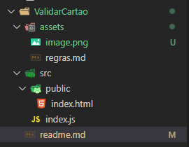
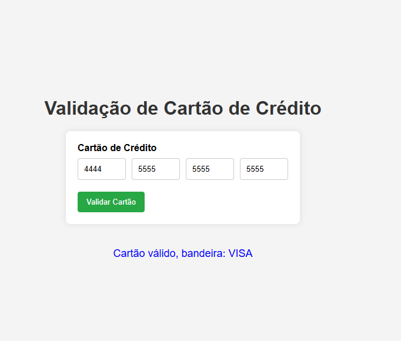

# Validação de Cartão de Crédito

## Descrição
Este projeto é uma aplicação web simples para validar números de cartões de crédito. A aplicação permite que o usuário insira os dígitos do cartão de crédito em quatro campos de entrada separados e, ao submeter o formulário, verifica se o número do cartão é válido e identifica a bandeira do cartão.

## Tecnologias Utilizadas
- **Node.js**: Ambiente de execução JavaScript.
- **Express**: Framework web para Node.js.
- **Body-Parser**: Middleware para analisar o corpo das requisições HTTP.
- **HTML/CSS**: Para a estrutura e estilo da interface do usuário.
- **JavaScript**: Para a lógica de validação no lado do cliente.

## Estrutura do Projeto



## Instalação
1. **Clone o repositório**:
   ```sh
   git clone https://github.com/seu-usuario/ValidarCartao.git
   cd ValidarCartao
   ```

2. **Instale as dependências
   
   ```
    npm install
   ```

## Execução
   ```
   node src/index.js
   ```
acesse a aplicação em http://localhost:3000

## Exemplo da tela



contato Linkedin: [Jean Marcelo CaLão](http://linkedin.com/in/jeancalao) 
